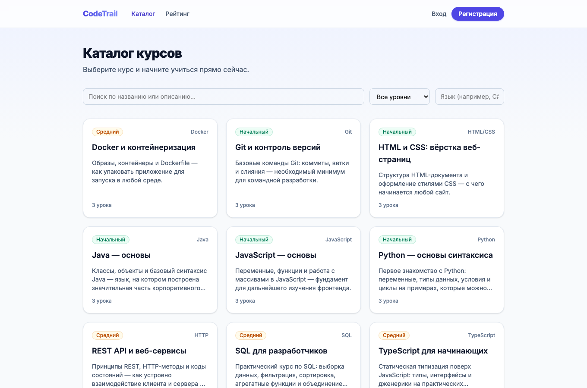
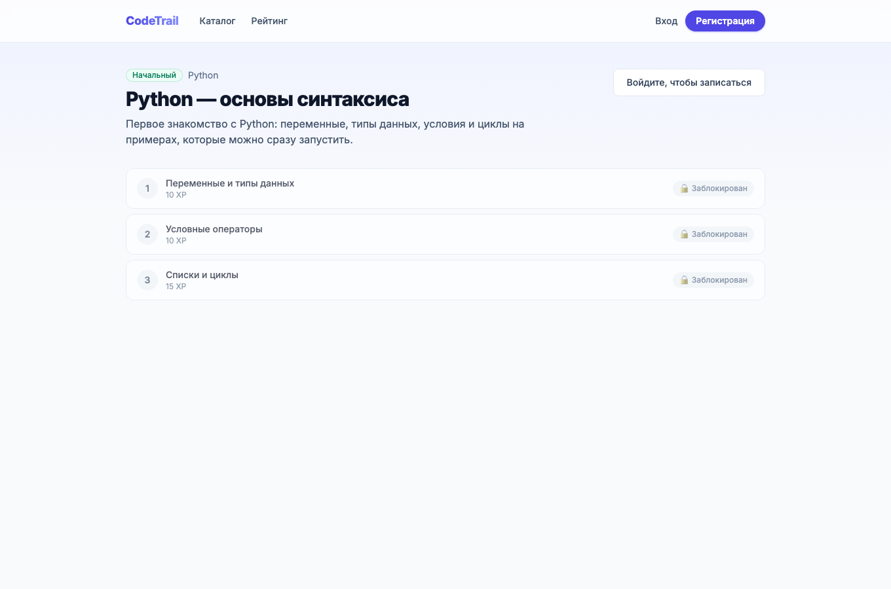
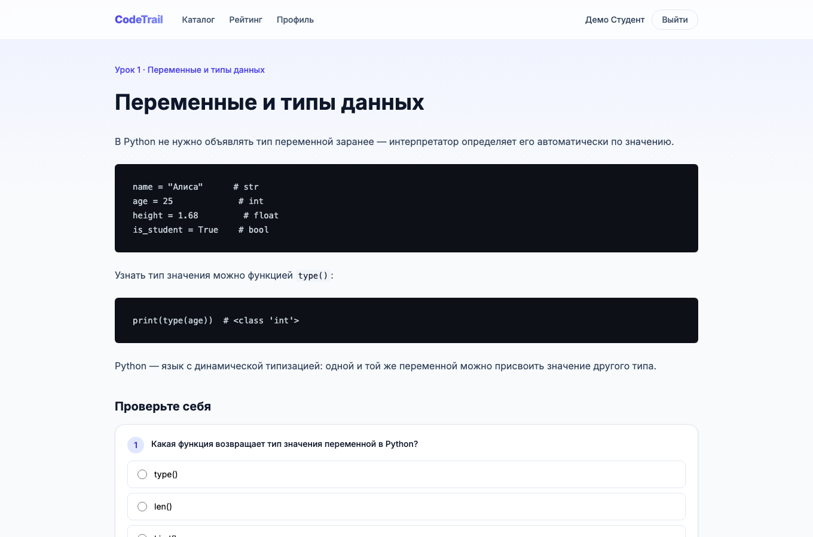
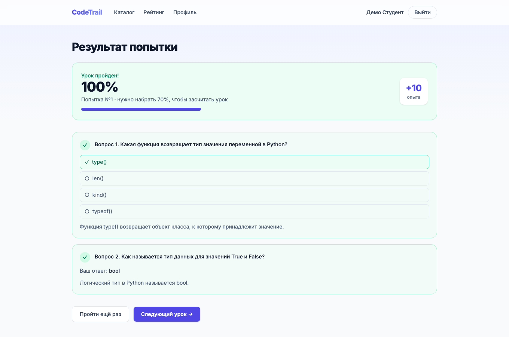
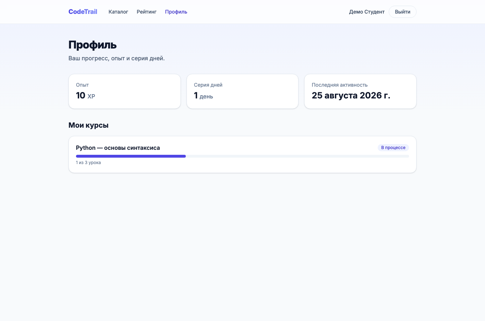
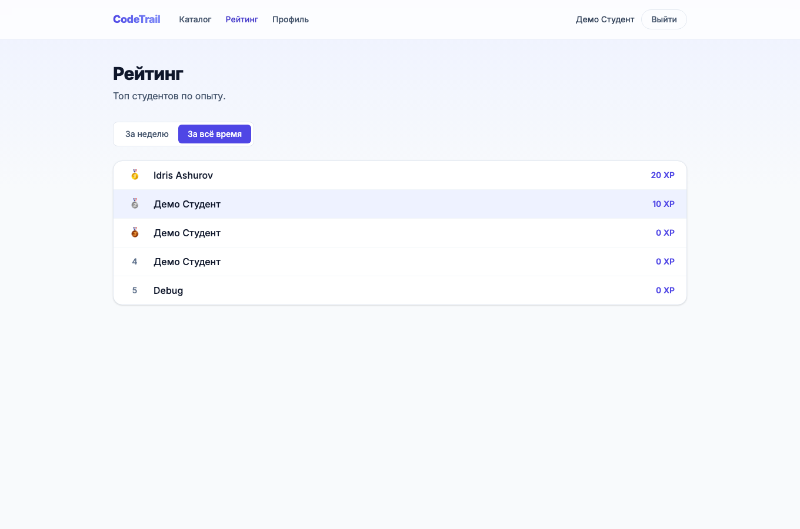
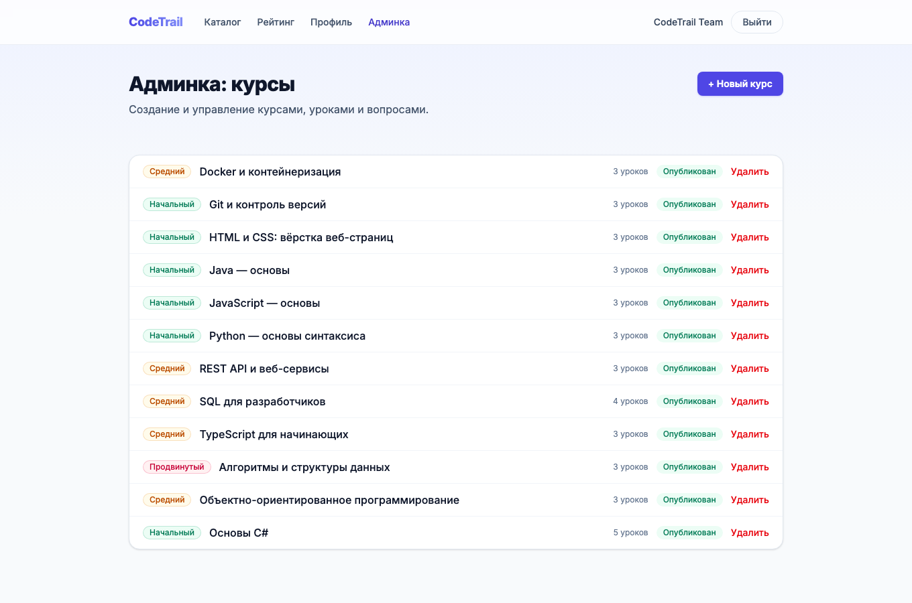
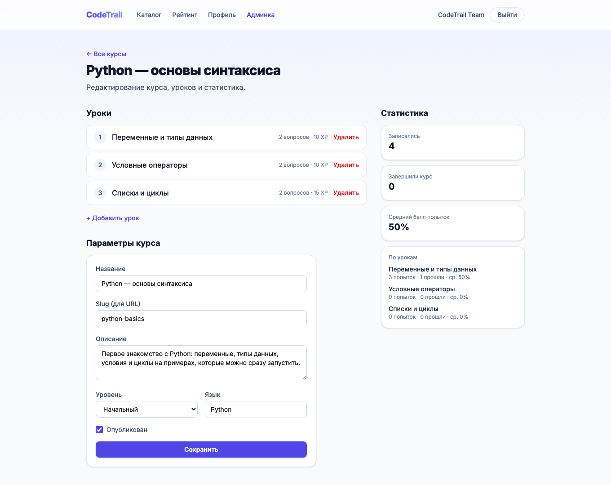

# CodeTrail

Платформа для изучения программирования: каталог курсов, последовательная разблокировка уроков, серверная проверка тестов, прогресс, опыт (XP) и серия активных дней (streak).



## Содержание

- [Стек](#стек)
- [Архитектура](#архитектура)
- [Быстрый старт](#быстрый-старт)
- [Тестовые учётные записи](#тестовые-учётные-записи)
- [Тесты](#тесты)
- [Роли](#роли)
- [Скриншоты](#скриншоты)
- [Приёмочный сценарий](#приёмочный-сценарий)
- [Структура репозитория](#структура-репозитория)

## Стек

**Бэкенд**
- ASP.NET Core 10 Web API
- Entity Framework Core (Code First; одна миграция `InitialCreate`, применяется автоматически при старте)
- SQLite — файловая БД без установки сервера, создаётся автоматически при первом запуске
- JWT-аутентификация, роли Student/Admin
- DataAnnotations-валидация, глобальный обработчик исключений (кастомные `AppException` → корректные HTTP-коды и `ProblemDetails`)
- xUnit — 34 модульных теста (EF Core InMemory)
- Swagger / Swashbuckle

**Фронтенд**
- React 19 + TypeScript + Vite
- React Router v7, code-splitting по маршрутам (`React.lazy`)
- react-hook-form + zod — валидация форм на клиенте, зеркалящая бэкенд
- Tailwind CSS v4
- react-markdown + rehype-highlight — рендер теории уроков с подсветкой синтаксиса

## Архитектура

Решение разделено на слои с однонаправленными зависимостями:

```
Api  →  Application  →  Domain
 └──────→  Infrastructure  ↗
```

| Слой | Назначение |
|---|---|
| **CodeTrail.Domain** | Сущности предметной области, без зависимостей от других слоёв |
| **CodeTrail.Application** | Бизнес-логика, сервисы, интерфейсы, DTO; зависит только от Domain |
| **CodeTrail.Infrastructure** | EF Core DbContext, доступ к данным, реализации интерфейсов Application; зависит от Domain и Application |
| **CodeTrail.Api** | Контроллеры, конфигурация DI, точка входа приложения; зависит от Application и Infrastructure |

Контроллеры не содержат бизнес-логики и не обращаются к DbContext напрямую. Наружу отдаются только DTO — сущности EF за пределы Infrastructure/Application не выходят. Публичные DTO уроков никогда не содержат `isCorrect` или ключ правильного ответа — верный вариант известен только серверу в момент проверки.

## Быстрый старт

Требуется: [.NET SDK 10](https://dotnet.microsoft.com/download) (версия зафиксирована в `global.json`) и [Node.js 20+](https://nodejs.org/).

### 1. Бэкенд

JWT-ключ подписи не хранится в репозитории — задаётся один раз через `dotnet user-secrets`:

```bash
cd src/CodeTrail.Api
dotnet user-secrets set "Jwt:Key" "$(openssl rand -base64 48)"
dotnet run
```

При первом запуске приложение само:
1. применяет миграцию `InitialCreate` к новому файлу `codetrail.db` (SQLite, создаётся рядом с проектом);
2. засеивает 12 готовых курсов (110+ уроков и вопросов) и учётную запись администратора.

API поднимется на `http://localhost:5094` (Swagger — `http://localhost:5094/swagger`).

### 2. Фронтенд

```bash
cd client
npm install
npm run dev
```

Откроется на `http://localhost:5173` и обращается к API по адресу из `VITE_API_BASE_URL` (по умолчанию `http://localhost:5094/api`, см. `client/.env.example`).

### 3. Проверка

Откройте `http://localhost:5173`, зарегистрируйтесь или войдите тестовой учётной записью ниже.

## Тестовые учётные записи

| Роль | Email | Пароль |
|---|---|---|
| Администратор | `admin@codetrail.local` | `Admin123!` |
| Студент | зарегистрируйте свою через форму регистрации | — |

## Тесты

```bash
dotnet test
```

34 модульных теста на бизнес-правила (проверка ответов, последовательная разблокировка, XP, серия дней, права доступа), EF Core InMemory — независимы от production-провайдера БД (SQLite).

## Роли

| Роль | Возможности |
|---|---|
| Гость | Каталог курсов, страница курса, регистрация/вход |
| Студент | + запись на курс, прохождение уроков и тестов, прогресс, профиль, рейтинг |
| Администратор | + CRUD курсов, уроков, вопросов, статистика по студентам |

## Скриншоты

| | |
|---|---|
| **Каталог курсов** — фильтр по уровню и языку, пагинация | **Страница курса** — оглавление, следующий урок разблокируется прогрессом |
|  |  |
| **Урок** — теория на Markdown с подсветкой кода, тест внизу | **Результат попытки** — по вопросам, без утечки правильных ответов до сдачи |
|  |  |
| **Профиль** — опыт, серия дней, прогресс по курсам | **Рейтинг** — за неделю и за всё время |
|  |  |
| **Админка** — список курсов | **Админка** — редактирование курса, уроки, живая статистика |
|  |  |

## Приёмочный сценарий

Сценарий из ТЗ, пройденный end-to-end на реальном бэкенде и фронтенде (не мок):

1. **Регистрация нового пользователя и вход в систему** — форма создаёт аккаунт и сразу авторизует.
2. **Каталог → фильтр по уровню → страница курса** — фильтрация на клиенте без перезагрузки.
3. **Запись на курс** — кнопка «Записаться», после записи виден статус уроков.
4. **Прямой переход на третий урок по ссылке** — API возвращает `403`, второй и третий уроки ещё заблокированы: доступ запрещён с понятным сообщением, а не тихим редиректом.
5. **Прохождение первого урока с результатом ниже 70%** — попытка не засчитана (`isPassed: false`), второй урок остаётся заблокированным.
6. **Повторное прохождение выше порога** — урок засчитан, второй урок открылся, XP пользователя вырос.
7. **Профиль** — отображает обновлённый опыт и серию дней.
8. **Вход администратором → создание курса с уроком и вопросом** — через `/admin`, курс, урок и вопрос создаются и видны сразу.

## Структура репозитория

```
CodeTrail.sln
global.json                     # фиксирует SDK .NET 10
src/
  CodeTrail.Api/                # контроллеры, DI, аутентификация, точка входа
  CodeTrail.Application/        # DTO, интерфейсы сервисов, бизнес-исключения
  CodeTrail.Domain/             # сущности, enum'ы — без внешних зависимостей
  CodeTrail.Infrastructure/     # EF Core, миграции, сидирование, реализации сервисов
tests/
  CodeTrail.Tests/              # 34 модульных теста (xUnit + EF Core InMemory)
client/
  src/
    api/                        # HTTP-клиент, типы DTO, обёртки над эндпоинтами
    components/                 # переиспользуемые UI-компоненты по доменам
    pages/                      # маршрутизируемые страницы
    router/                     # конфигурация маршрутов, защита по роли
docs/
  screenshots/                  # скриншоты для этого README
```
